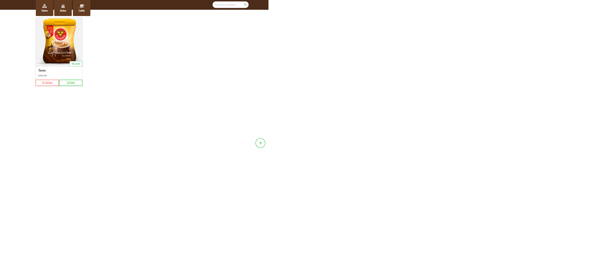

<h1 align="center"> Projeto Macieul's Coffee </h1>

## :memo: Descrição
O projeto **Macieul's Coffee** é um site desenvolvido para promover uma cafeteria fictícia, apresentando seu menu, história e informações sobre os serviços. O foco está em oferecer uma experiência visual agradável e intuitiva para os visitantes.

## :books: Funcionalidades
- **Homepage**:
  - Informações sobre a cafeteria.
  - Apresentação do menu de produtos.
  - Seção de contato para os clientes.

- **Design Responsivo**:
  - Layout adaptável para diferentes tamanhos de tela, garantindo uma boa experiência no desktop e dispositivos móveis.

- **Funcionalidades Dinâmicas**:
  - Interatividade implementada com JavaScript para melhorar a navegação.

## :wrench: Tecnologias Utilizadas
- **HTML5**: Estrutura da página.
- **CSS3**: Estilos customizados para design e layout.
- **JavaScript**: Funcionalidades dinâmicas e interatividade.
- **Recursos Visuais**:
  - Imagens localizadas no diretório `img`.

## Estrutura do Projeto
- **`index.html`**: Página principal do site.
- **Diretório `css`**:
  - `style.css`: Arquivo principal de estilos.
- **Diretório `js`**:
  - `index.js`: Arquivo com os scripts de interação.
- **Diretório `img`**:
  - Contém as imagens utilizadas no site.

## 📷 Preview
### Página Inicial

## 🧑‍🏫 Aprendizados
Este projeto proporcionou a oportunidade de aplicar conceitos de desenvolvimento web, incluindo:
- Criação de layouts responsivos com CSS3.
- Uso de JavaScript para adicionar interatividade.
- Estruturação de sites com HTML5 de forma organizada.
- Melhoria na combinação de design visual e funcionalidade.

---
